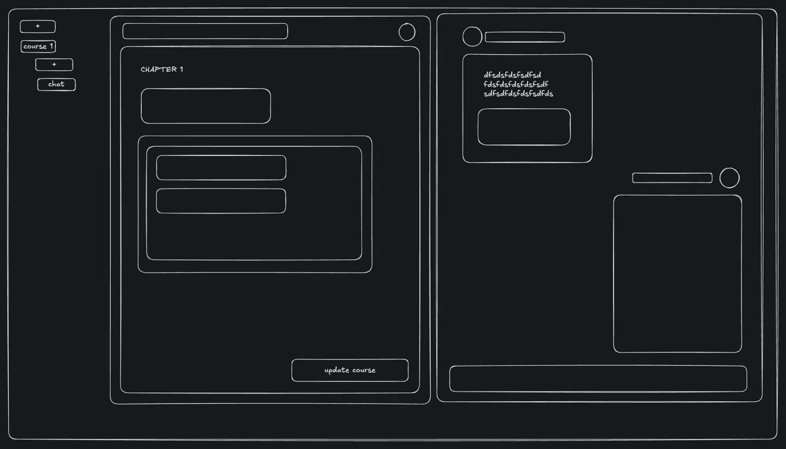
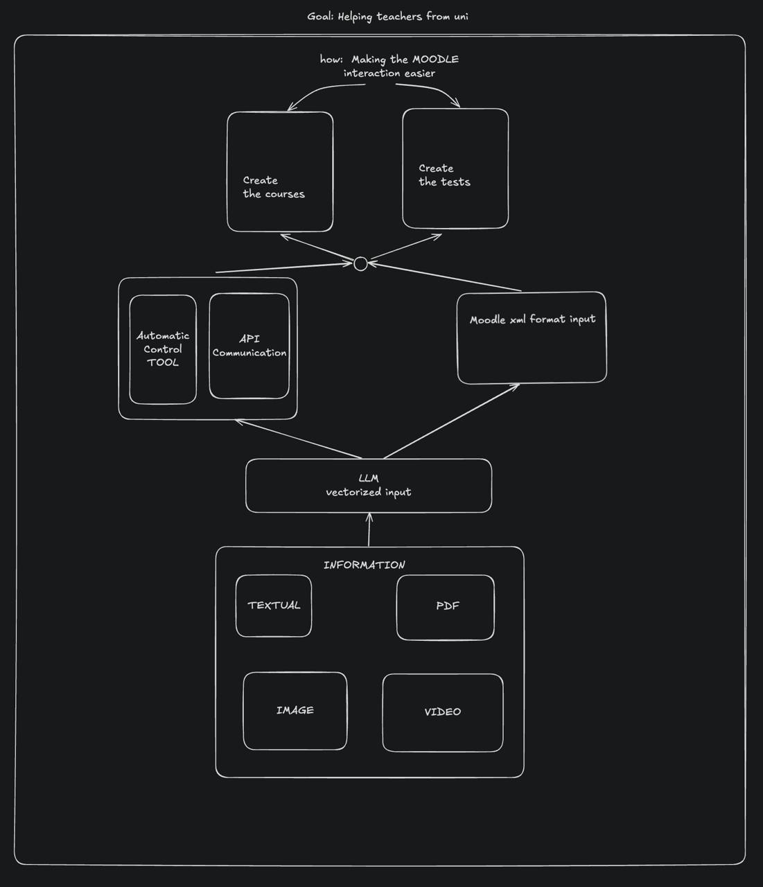

# Moodle Course Creator

A modern web application that helps university teachers easily create, manage, and update course content on Moodle, powered by AI assistance.



## 🚀 The Problem

Being a teacher is challenging, especially at the university level. Research shows that teachers spend only 46% of their time actually teaching, with the rest dedicated to:

- Grading and providing feedback (5 hours)
- Planning and preparing materials (5 hours)
- Administrative work (3 hours)
- Non-teaching student interaction (3 hours)
- Other critical activities (8 hours)

Moodle's complex interface complicates this workload further. According to European research, 91% of teachers report increased workload due to the digitalization of course materials.

Many teachers struggle with:
- Creating and updating course materials each semester
- Dealing with student copying of answers from previous years
- Navigating Moodle's unintuitive interface and hidden options
- Managing question banks and quiz creation
- Time-consuming grading processes

## 💡 Our Solution

Moodle Course Creator streamlines the course creation process through:

- **AI-Assisted Content Generation**: Create tailored materials, quizzes, and tasks
- **Intuitive Course Editing**: Simple structure and organization tools
- **One-Click Updates**: Seamlessly sync changes to Moodle
- **Custom Knowledge Base**: Fine-tuned to course-specific content
- **Consistent Learning Experience**: Generate unique assessments each semester



## ✨ Key Features

- **Tailored Content Support**: Create diverse materials from text, PDFs, PPTs, etc.
- **Intuitive Course Editor**: Easily structure and rearrange content with drag-and-drop 
- **AI Chatbot**: Course-specific assistant for generating content
- **Vector Database Management**: Add/remove files from your knowledge base
- **Smart Content Generation**: Automatic content type detection and formatting
- **Moodle XML Integration**: Generate quiz content directly compatible with Moodle

## 🛠️ Technical Stack

- **Frontend**: Next.js with Tailwind CSS
- **Backend**: FastAPI
- **Databases**: PostgreSQL & MongoDB
- **LLM Support**: Flexible model selection
- **Deployment**: Dockerized for easy scaling
- **Hosting**: Cost-effective (less than one teacher's monthly salary)

## 🎯 Strategic Impact

- **Reduce Teacher Burnout**: Minimize tedious tasks
- **Increase Academic Integrity**: Foster genuine student learning
- **Enhance Faculty Retention**: Simplify Moodle, improve satisfaction
- **Boost Institutional Reputation**: Showcase innovation and quality-driven education

## 📈 Measurable Outcomes

- Reduce content preparation time by up to 80%
- Enhance student critical thinking and performance
- Improve teacher satisfaction and retention

## 💼 Getting Started

```bash
# Clone the repository
git clone https://github.com/yourusername/moodle-course-creator.git

# Install dependencies
npm install

# Run the development server
npm run dev
```

## 🔗 Integration with Moodle

Moodle Course Creator seamlessly integrates with existing Moodle installations. The integration process is simple and requires minimal configuration.

## 📋 License

[MIT](LICENSE) 